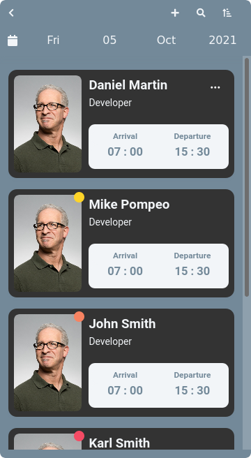
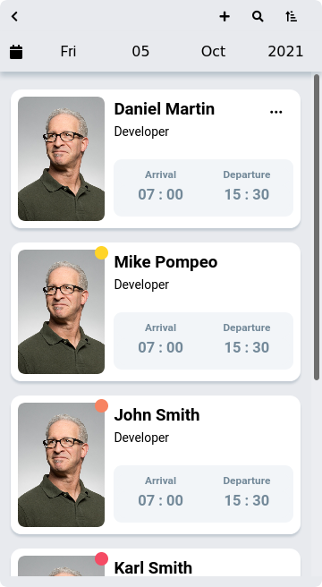
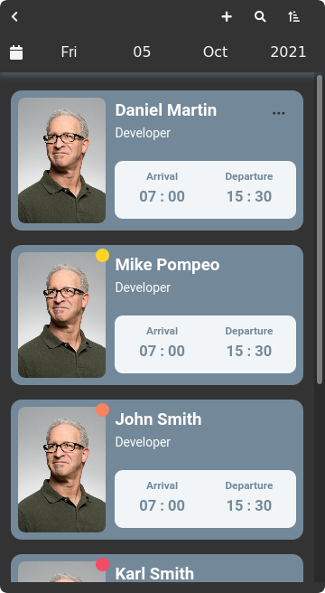

## Attendance

> Oct 20 2021\
> <small>update : Nov 6 2021</small>\
> <a href="https://codepen.io/miko-github/full/QWMmbxp" target="_blank"><strong>Live Preview</strong></a>

<!--
Hi theSre 👋,
if you like my `README.md`, don't worry, use them 🤗
i mean you can copy/paste them 😉
because i love ❤️ opensource, did you like it?
-->
<!-- [![Open Source Love][badge-open-source]][social-github] -->

### SCREENSHOTS

  

### LICENSE and MORE

powered by [<strong>YEK (yek-sass)</strong>](https://github.com/yek-org/yek-sass) and [<strong>YEK (yek-js)</strong>](https://github.com/yek-org/yek-js)\
under [<strong>MIT</strong>](./LICENSE) license
